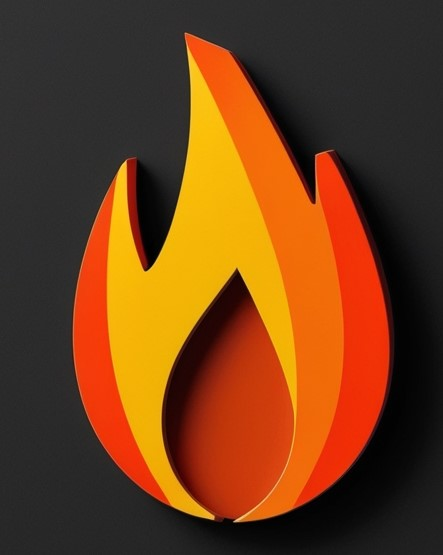

<picture>
  

    <source media="(prefers-color-scheme: dark)" srcset="white.jpg" width="100" height="100">
    <source media="(prefers-color-scheme: light)" srcset="black.jpg" width="100" height="100">
    
  

</picture>

# About me

<!-- Esto es un ejemplo de un comentario en HTML -->

I have a solid experience in university teaching and in projects of various kinds, with a specialized focus on simulation through finite elements and computational fluid dynamics. Throughout my career, I have acquired advanced skills in this area through participation in multidisciplinary projects and the practical application of engineering problems. The consolidation of these knowledge and skills in the use of simulation tools is reflected in the use of programs such as SolidWorks, ANSYS, FDS, and 3DEXPERIENCE.

My goal as a professor with an emphasis on simulation is to take students beyond theory, providing them with practical and applied experiences that strengthen their understanding and skills in this area. My commitment to continuous improvement is reflected in the constant preparation of educational materials, using cases and exercises that integrate the latest trends and advances in this field of work.

  

 Interests 

Currently, I am interested in topics such as Python, FDS (Fire Dynamics Simulator), FEA (Finite Element Analysis) and CFD (Computational Fluid Dynamics). These areas allow me to explore and apply my knowledge in simulation and systems analysis to solve complex engineering problems

| Topics | Area of Interest |
|----------|-----------------|
|     1    | CFD          |
|     2    | FDS              |
|     3    | FEA              |
|     4    | Python              |

---
> I am excited to continue learning and advancing my skills in these fields.
- Diego
